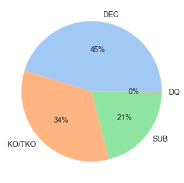
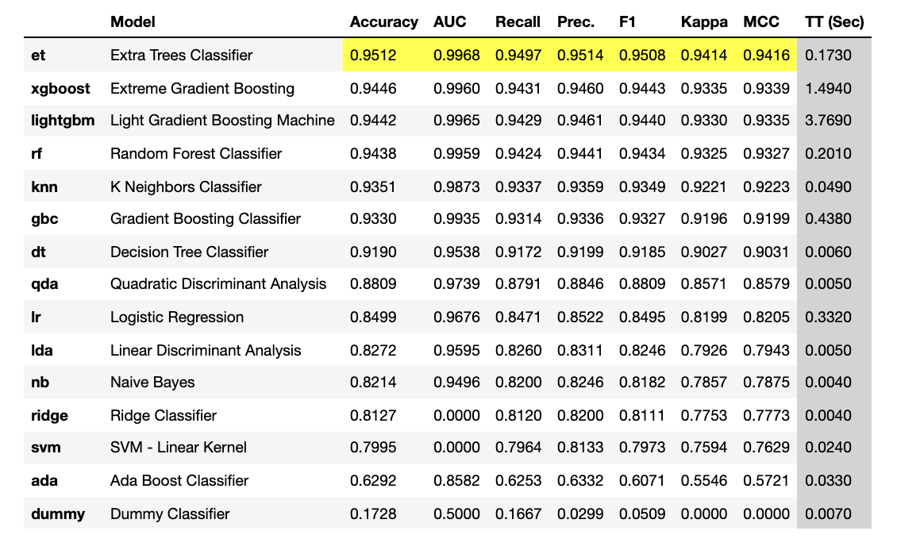
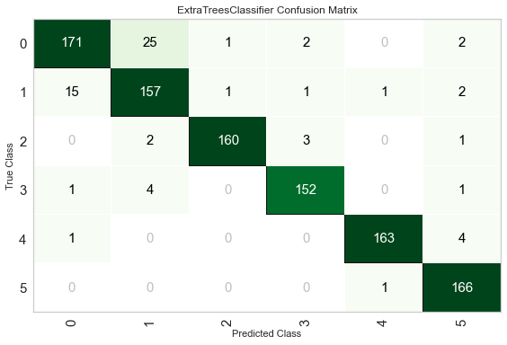
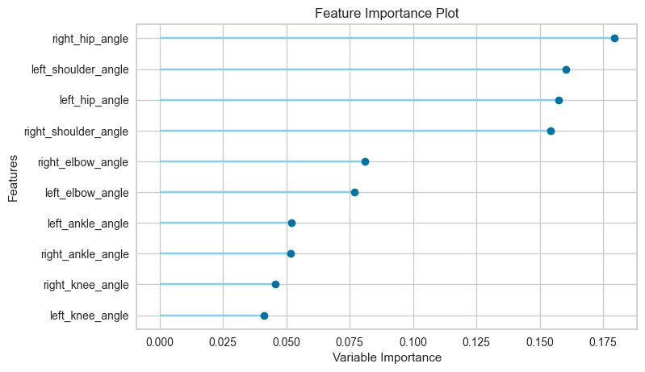
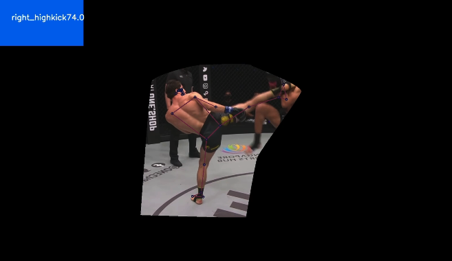

# DSI25 Capstone Project
---
# Executive Summary
Mixed Martial Arts (MMA) is one of the most exciting sports with adrenaline running in both fighters, viewers, and even judges. Currently, 45% of fights last through all rounds and the eventual winner is decided by judges who score each round. The scoring are based on several criteria. In general they are guided by the following:
- Effective striking
- Effective grappling
- Effective aggressiveness
- Control of fighting area

This may bring some level of subjectiveness to the scoring system as each judge has their own interpretation of the guidelines. With Computer Vision, and assistive tool to the judges can be deployed in a similar fashion to Football's Video Assistant Referee, or Tennis' Hawk-Eye System.

This project produced a model with 93% accuracy and 93% F1-Score, and is able to predict between 6 types of strikes based on Computer Vision and Pose Estimation tools. While alot more work is required to fully realise its potential, this shows that there is room for use of Computer Vision and Video Analytics in the sport of MMA. With the right camera angles, video quality, better pose estimation technology, and support from MMA organisations, the future of MMA can definitely see the adoption of Computer Vision and Video Analytics.

---
# Background and Problem Statement
Mixed Martial Arts (MMA) is currently one of the fastest, if not the fastest growing sport in the world. It's growth is hugely led by Ultimate Fighting Championship (UFC). Closer to home, we also have the One Championship that aims to emulate the success of the UFC. Either way, the sport is growing rapidly. However, it seems that usage of video for analysis is not as prevalent as in other sports such as tennis, football, American football, and such.

As such, this project aims to cover that gap; utilising Computer Vision to analyse strike attempts or aggressiveness by fighters. The result can then be used for a variety of use-case such as assistive CV tool for judges or even to analyse fighter's techniques. For this project, we will focus on the former.

45% of fights in the UFC ends in Decision, which means both fighters last through 3 or 5 rounds, leaving the judges to decide on the eventual winner. It can be tricky for the judges to score the rounds especially when both fighters are equally matched. There is bound to be some subjectivity involved. As such, this assistive CV tool can potentially bring some objective aspect in the decision-making process.

---
# Data Cleaning / Preprocessing
Frames of different types of MMA strikes were collected from Youtube and edited using Davinci Resolve to mask the fighters such that only one person can be inside the frame. This is to allow for pose estimation to be applied, which will be discussed furrther later.

OpenCV and Mediapipe were used together to extract pose estimation keypoint values for these frames. 99 keypoint values and 10 angle values were collected. The angles were feature engineered from the keypoint values. However the keypoint values themselves were excluded, as they proved to lead to overfitting.

These angle values were converted into a dataframe and PyCaret was used to classify the different strikes.
- right high kick
- left high kick
- right low kick
- left low kick
- right punch
- left punch

---
## Data Dictionary

|        Variable Name                |    Data Type   |        Description         |
|:-----------------------------------:|:--------------:|:--------------------------:|
|         right_elbow_angle           |      float     |angle of right elbow        |
|         right_shoulder_angle        |      float     |angle of right shoulder     |    
|         right_hip_angle             |      float     |angle of right hip          |
|         right_knee_angle            |      float     |angle of right knee         |
|         right_ankle_angle           |      float     |angle of right ankle        |
|         left_elbow_angle            |      float     |angle of left elbow         |
|         left_shoulder_angle         |      float     |angle of left shoulder      |
|         left_hip_angle              |      float     |angle of left hip           |
|         left_knee_angle             |      float     |angle of left knee          |
|         left_ankle_angle            |      float     |angle of left ankle         |
|         attack_type                 |   categorical  |label of type of strike     |

---
## Modelling

PyCaret generated the following as the top 3 models:
1. Extra Tree Classifiers
2. Extreme Gradient Boosting
3. Light Gradient Boosting

The decision was made to use the Extra Trees Classifier as the final model.
The data set was train/test split by 0.7/0.3.
With the train set, the model achieved accuracy of 0.95 and F1 of 0.95.
With the test set, the model achieved accuracy of 0.93 and F1 of 0.93.

This shows that the model is capable of correctly classifying the different types of strikes using angles alone.
As shown by the confusion matrix below, the target labels are represented as such:
- 0: right high kick
- 1: left high kick
- 2: right low kick
- 3: left low kick
- 4: right punch
- 5: left punch

The topmost features in predicting the type of strike were related to shoulders and hips as seen in the graph below. As such for future deployment of this tool, hips and shoulders should be visible as much as possible for the computer vision and pose estimation to pick up on.

A potential deployment of this model can be seen below, the frames had to be masked out as the pose estimation cannot run on multiple person in the frame. While more improvement is necessary, this is a good starting point.

---

# Conclusion and Recommendation

In conclusion ,the model was able to successfully classify 6 different types of strikes using Computer Vision (CV) and Pose Estimation, with very high accuracy. It also scored very well in other metrics. While there is alot more to be done, this can pave the way for the future of CV in MMA.

Future improvements of this CV can also include detecting other types of MMA moves such as takedown attempts which can be subjective, as opinions may differ on what constitutes a takedown. Also, this can be complemented by other tools such as facial recognition tools using neural network that can determine if a fighter is hurt which may advise the referee to potentially stop a fight before he gets unnecessarily hurt further.
